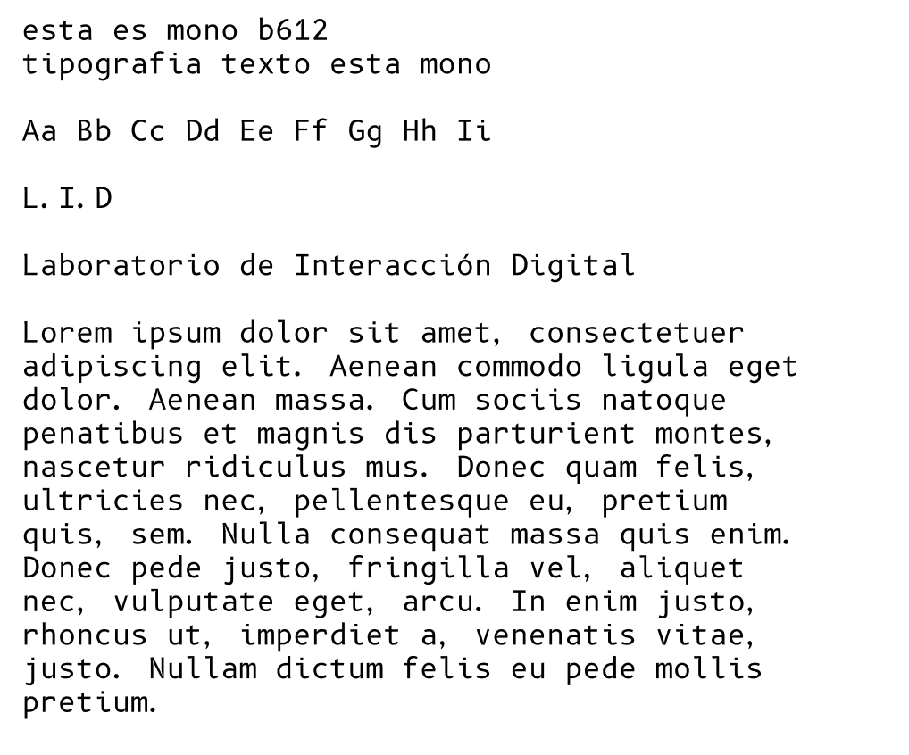

# Apuntes del estilo de la barra de navegación

Empecé a hacer todo el css desde 0

## Colores

En primer lugar hice las pseudo clases para los colores.

Esto servirá para "llamar" a los colores cuando los necesite sin tener que escribir el código uno a uno.

Además, si quiero cambiar el color después, sólo cambio el `:root` para que cambien todos.

```css
:root {
  --background-color: #000000;
  --text-color: #FFFFFF;
  --text-color-heading: #39FF14;
  --text-color-link: #39FF14;
  --text-color-link-visited: #1DA600;
  --nav-background-color: #39FF14;
  --nav-text-color: #000000;
}
```

## Tipografía

También hice las pseudo clases para la tipografía.

Vi que Sofía había propuesto usar la fuente **mono b612** y me gustó mucho porque es un estilo de código que queda muy bien con el ambiente del Lid.


Fuente mono b612 - propuesta Sofia

También propuso **NewEdge666** para los títulos.
Pero no logré encontrarla en Google Fonts ni en ningún lugar gratis. así que mantuve la que estaba desde antes


Fuente NewEdge666 - propuesta Sofia

